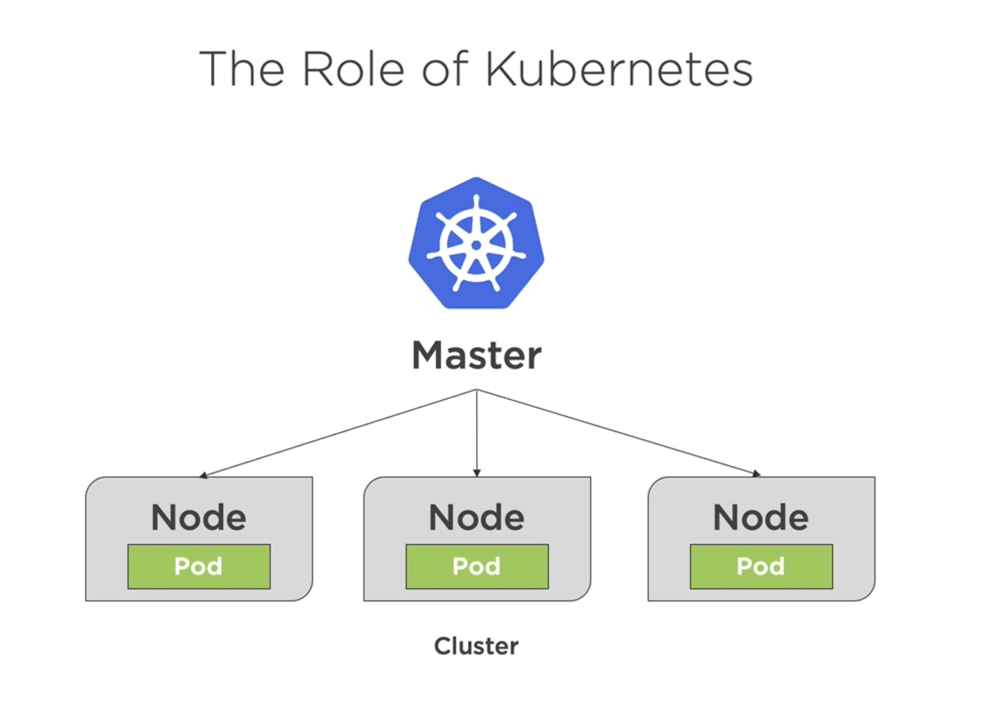
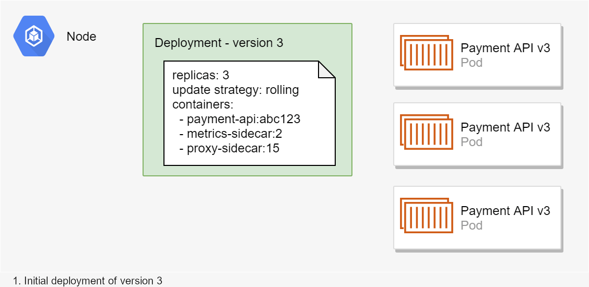
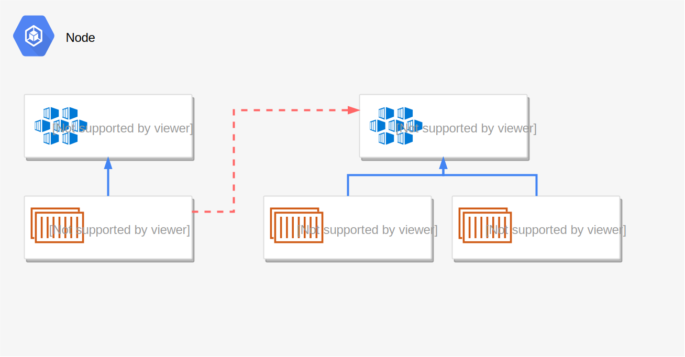
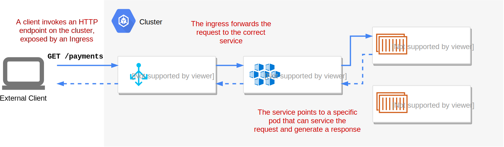
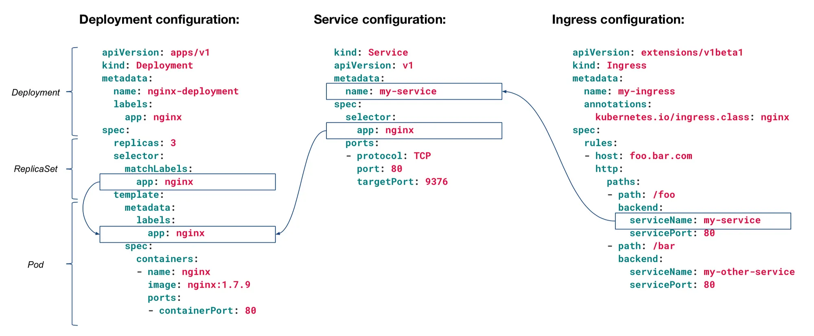
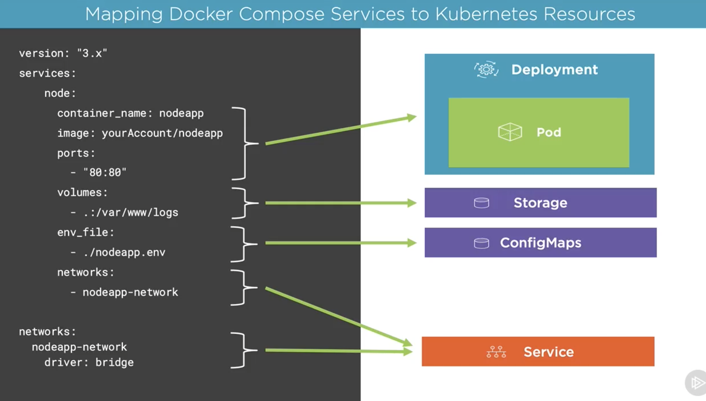

# Comparing Docker Compose & Kubernetes

## Devs looking to switch from running containers using Docker compose -> full on Kubernetes

## Pre-req:

- Docker Disktop  (comes with Kubernetes) / Minikube (K8s install)
- Core concepts of Kubernetes (Pods, Deployments, Services)

## 1) Docker-Compose review

- Spin up multi-service applicalication in one command.
- Service(s) configuration is declared in a `docker-compose.yml`
- Running `docker-compose build` -> builds the images of each of the defined services.
- Syntax:

```yaml
version: '3.x' # version of docker compose were using

services: #services section declaration
    myServiceA: #service declatation
        build: #build this service from our Dockerfile defined below + context
            context: . 
            dockerfile: Dockerfile
        networks:
            - myUserDefinesNetwork


    myServiceB:
        image: nginx #build this service difrect from the public nginx image n redistry
        networks:
            - myUserDefinesNetwork

networks:
    myUserDefinedNetwork:
        driver: bridge
```

THEN.. we can run `docker-compose build` (to build images)
            or run `docker-compose up` to spin up the services

NOW.. Q: why move to K8s when compose can do all this?
A
        *Compose (unless in swarm) will only manage the applications on a single node - the machine compose is running on.

        *Doesnt handle distrubuted nodes / cluster of nodes running services
        
        *Doesnt handle automatically scaling up and down
        
        *Doesnt handle auto healing the cluster (if a node/servie fails, its a manual process to bring up another)
                ^^ Kubernetes Handles this. Thats it's power.

## 2) Kubernetes review

The basic Kubernetes components for developers
Instead of describing the multitude of pieces that make up a Kubernetes cluster, I'm going to describe just five concepts:

- Nodes
- Pods
- Deployments
- Services
- Ingresses



The master node is controlled by us (you) via $kubectl (kubernetes command line tool)

> * Note that if you're running a Kubernetes cluster locally for development purposes it's common to have a single Node (your machine or a VM) which is a master node that has been "tainted" to also run containers.

Kubernetes is made up of a few 'tiers' or resources:

- Lowest = POD (where your containers run)
- Mid = Deployment (how your pods will be deployed + replicas)
- High = Service (network interfacing to your pod deployment + load balancing)
 & Storage/ConfigMaps/Secrets for env variables/seneitive data

- Usually there will be at least TWO yaml files for your 'application'
    1) Deployment yaml (pod manifest - detailing image to run + replicas)
    2) Service yaml (

#### Deplomyment


```yaml 
Deployment

apiKind: apps/v1 #version of K8s thiss file is using
kind: Deployment #which kind of file is this describing (Deployment / Service ...)
metadata: # describe the deployment
    name: myapp-deployment
    labels:
        app: myapp  #labels are important as they serve as a way to LINK k8s resources together
    spec:
        selector:
            matchLabels: #selector match labels instructs which from the TEMPLATE section we should use as our pod deployment, since we say here match 'app: myapp', K8s will deploy pods from the 
            # template below qui matches (or has a label) 'app: myapp'

            #matchLabels: tells what pods the deployment will apply to.
                app: myapp
        template: #the POD TEMPLATE
            metadata:
                labels:
                    app: myapp  #the pod template has this label attached to it.
            spec:
                containers:
                    - name: myapp-image
                    image: redis:latest


```

#### Service: 

I think of a service as effectively an in-cluster load-balancer for your pods. When you create a deployment, you will likely also create a service associated with that app's pods. If your deployment requires three instances of the "purchasing app", you'll create a single service to go with it.

When one pod needs to talk to another, for example the "Order API" needs to contact the "Payment API", it doesn't contact a pod directly. Instead, it sends the request to the service, which is responsible for passing the request to the pod.

_Pods talk to other pods via services, instead of contacting them directly._



```yaml
Service

apiVersion: v1
kind: Service
metadata:
  name: api-service
spec:
  selector:
      app: api
  ports:
    - name: api-port
      protocol: TCP
      port: 8081
      targetPort: 80

    - name: metrics-port
      protocol: TCP
      port: 8082
      targetPort: 81

```


### Ingress

Services are essentially internal to the Kubernetes cluster. Your apps (pods) can call one another using services, but this communication is all internal to the cluster. An ingress exposes HTTP/HTTPS routes from outside the cluster to your services. Ingresses allow your ASP.NET Core applications running in Pods to actually handle a request from an external user:



_An Ingress exposes HTTP endpoints for a service that clients can call. HTTP requests to the endpoint are forwarded by the Ingress to the associated service on a node, which passes the request to the Pod._

**While services are internal load balancers for your pods, you can think of Ingresses as providing external load balancing, balancing requests to a given service across multiple nodes.**

If you're confused, don't worry. For ASP.NET Core applications, you can commonly use the default ClusterIP to act as an "internal" load-balancer, and use an ingress to route external HTTP traffic to the service.




Kubernetes COMMANDS:
- `kubectl get [all | pods | services | deployments] ` => prints a list of all the specified recouce
- `kubectl create -f my-new-resource-file.yml` => create a new resource from scratch
- `kubectl apply -f my-resource-file.yml` => either CREATEs or UPDATES an exising resource (i.e. deployment replicas from 3 => 100) use `apply -f file.yml`
- `kubectl port-forward [pod name] [ports]` => like exposing a port ==port in Docker container

## 3) Mapping Docker-Compose services to Kubernetes components


